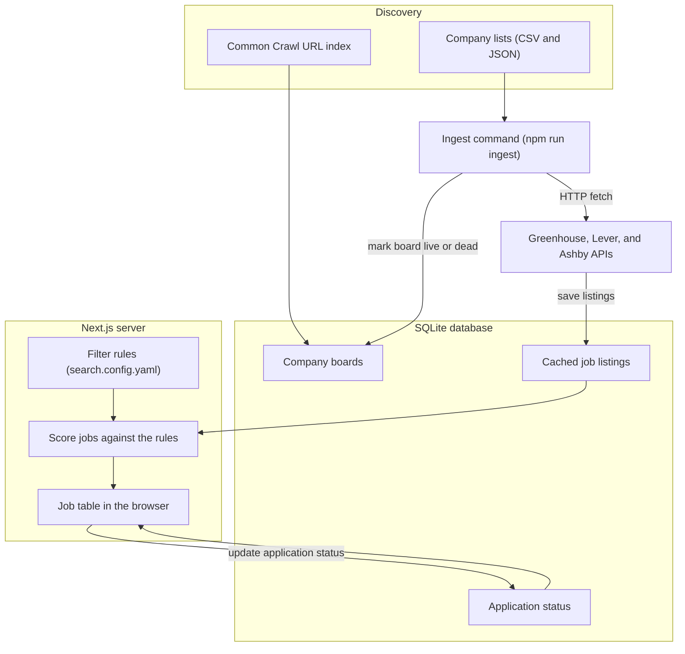

# Agenda

1. **Self-introduction** (2 min)
2. **Project Overview** (2 min)
   - a. What is the inspiration behind Job Board?
   - b. Problem/solution
3. **Architecture Overview** (5–7 min)
   - a. High-level overview of the tech-stack
   - b. Codebase walkthrough
   - c. Technical challenges

4. **Live Demo** (3–5 min)
   - a. User configured filters
   - b. How jobs are ranked
5. **Roadmap** (2 min)
   - a. Next steps & new features
   - b. Plan to "get out of localhost"
6. **Q&A** (3–5 min)
7. **Extra Time:** demo client projects
