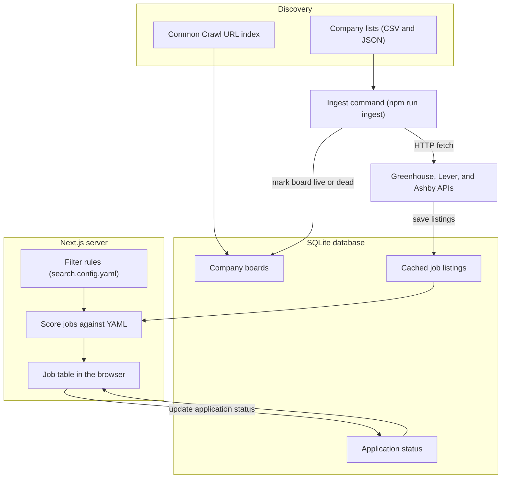

# VP walkthrough, diagram, and Q&A corrections

Talk **product first**, then **three boxes**, then open files. Do not start in `index.ts`. Skip [`src/instrumentation.ts`](src/instrumentation.ts) (Next warning only). Skip harvest unless they ask.

---

## Intro (30 seconds)

Personal job dashboard: pull public Greenhouse / Lever / Ashby JSON into a local SQLite file, rank against [`search.config.yaml`](search.config.yaml), track application status in a Next.js table. One user, this PC, no cloud.

---

## Architecture diagram (use on a whiteboard or first slide)

**What the diagram is for:** boxes are **systems**, arrows are **data/control**. It is not a line-by-line code map.

**Say out loud:**
- **Greenhouse, Lever, and Ashby APIs** — their servers. **HTTP fetch** is `fetchBoard` in `ats.ts`.
- **Score jobs against YAML** — `matchJob` in `match.ts`, on the server when the page loads, not in the browser and not SQL.
- **Job table in the browser** — `http://localhost:3000/` (`page.tsx`).

**Three sentences:** Discovery finds **company slugs**. Ingest fills **jobs** (and marks boards live/dead) into SQLite. The **server** reads that table; the UI does not crawl — YAML filters run in TypeScript on the Next.js server.

Ingest and the website are **separate processes**. Nothing is scheduled unless you add Task Scheduler yourself.

---

## File walk (say the one-liner, then one detail)

Walk in this order so backend ideas stack: config → fetch → tables → filter → UI.

1. **[`search.config.yaml`](search.config.yaml)** — Human rules (titles, NYC/remote, pay, skills). Not SQL. Refresh the page to apply. Title changes need re-ingest to **store** new role types.
2. **[`src/lib/config.ts`](src/lib/config.ts)** — Zod validates YAML so a typo fails fast.
3. **[`scripts/ingest.ts`](scripts/ingest.ts)** — CLI: import companies, then `fetchBoard` with concurrency 6 and a delay. Default: only `unknown`/`error` boards. `--force` refreshes live boards (slow).
4. **[`src/lib/ats.ts`](src/lib/ats.ts)** — The interesting backend file. Three URLs, `getJson` (timeout, **429** retry), `mapGreenhouse` / `mapLever` / `mapAshby` into one job shape. [`src/lib/html.ts`](src/lib/html.ts) strips HTML.
5. **[`src/lib/csv.ts`](src/lib/csv.ts)** — Streams LastRound CSV + optional aggregator JSON into `companies`.
6. **[`src/lib/db/schema.ts`](src/lib/db/schema.ts)** — Drizzle **types**: `companies`, `jobs`, `job_tracking`. Tracking is separate so ingest cannot wipe “Applied.”
7. **[`src/lib/db/index.ts`](src/lib/db/index.ts)** — Opens `data/jobs.db`, `CREATE TABLE IF NOT EXISTS`, WAL. Drizzle queries; bootstrap SQL does not version column changes.
8. **[`src/lib/match.ts`](src/lib/match.ts)** — `titleMatches` at ingest; full `matchJob` + rank score at read time.
9. **[`src/lib/jobs-query.ts`](src/lib/jobs-query.ts)** — `SELECT *` from jobs, then JS filter/sort/dedupe. YAML is **not** compiled to SQL.
10. **[`src/lib/url.ts`](src/lib/url.ts)** — Normalize apply URLs; collapse keys for the same posting.
11. **[`src/app/page.tsx`](src/app/page.tsx)** — `dynamic = "force-dynamic"`: SSR every request so SQLite is fresh. GET params for q/status/sort.
12. **[`src/app/status-select.tsx`](src/app/status-select.tsx)** + **[`src/app/actions.ts`](src/app/actions.ts)** — Client dropdown; Server Action upserts tracking (may copy status to duplicate listings).
13. **Only if asked:** [`src/lib/common-crawl.ts`](src/lib/common-crawl.ts) / [`scripts/harvest-cc.ts`](scripts/harvest-cc.ts) — CDX finds **new slugs**, not job text. [`scripts/dedupe-jobs.ts`](scripts/dedupe-jobs.ts) — one-off URL cleanup.

[`src/app/layout.tsx`](src/app/layout.tsx) is shell/fonts; one sentence max.

---

## Corrected Q&A (use these, not the drafts)

### How do you pull from job board APIs — cron, on-demand, worker?

**Now:** On-demand CLI. `npm run ingest` (and `--force` / `--limit`). No cron, no queue, no worker inside Next. Optional Windows Task Scheduler if the PC is on ([`COMMANDS.md`](COMMANDS.md)).

**If they want “production”:** A scheduled **worker** (or queue of board URLs), **not** on the web request path, with the same politeness (concurrency + delay + 429).

### How do you handle a source that changes its API/response shape?

Mappers are isolated in [`ats.ts`](src/lib/ats.ts). A Greenhouse HTML change should not break Lever. Invalid/empty JSON → board `dead` or `error` (`error` retried next ingest). I would add fixture JSON + tests on the mappers; optional Zod on the payload. I do not scrape career HTML as the source of truth — structured JSON is the contract.

### How do you dedupe the same job across sources?

Layers, not one magic key:

- PK `(ats, board_slug, external_id)`
- Normalized URL + `jobCollapseKey` (Greenhouse job id in URL, etc.)
- UI `listingCollapseKey` + union-find so the table shows one row
- Status update can fan out to collapsed duplicates
- `dedupe-jobs` script for leftover URL twins

Same company on Greenhouse **and** Lever after an ATS migration: **two rows on purpose** (different systems). Agency/duplicate postings: collapse by URL/id when we can; title+location is a weaker heuristic.

### Why not a separate backend if FE/BE need to scale independently?

Your V1 instinct is right: local POC, one user.

**Fix the V2 sentence:** Do **not** say “deploy this as-is to Vercel.” **Vercel serverless has no durable local `jobs.db`.** Concurrent lambdas + SQLite on disk does not work. Vercel is fine for a **UI** if the DB is **hosted** (Neon/RDS) and **crawling is not inside the serverless request**.

Better V2:

1. Keep crawl as a **separate job** (one machine or a queue), never “user loaded `/` so we hit 18k ATS APIs.”
2. Postgres (or SQLite on a **single** long-lived Node server) for the app DB.
3. Next stays the UI; extract a worker/API when you have **many users** or a second client.

Licensing: good to mention. Unauthenticated ATS JSON + CC is **not** a commercial license. Aggregator JSON is **CC BY-NC**. Paid SerpApi is **optional gap-fill**, not required to replace 18k slugs (Google will not dump that directory; CC/CSV already did the cheap coverage).

### How do you handle data fetching — RSC, API routes, or client?

**Server Components** load jobs (`page.tsx` → `listMatchedJobs`). **Server Actions** write status. **No API routes.** Client fetch only for the status `<select>` (optimistic UI + `router.refresh()`). Not SSG (`force-dynamic`) because the DB and YAML change without a rebuild.

### What breaks first with concurrent users — writes, crawls, or something else?

YAML-in-a-file is a **product** limit (one profile), not the first **infra** failure.

What breaks first:

1. **Crawl fan-out** — N users triggering ingest = hammering Greenhouse/Lever/Ashby (rate limits / ToS). Crawl must be **shared and scheduled**, not per session.
2. **SQLite writes** — one writer; concurrent status updates and ingest lock/fail.
3. **Read path** — every request loads **all jobs into memory** and filters in JS; many users × large table will CPU/RAM spike before “YAML.”

Then: per-user prefs in DB, connection pooling, SQL-side filters/indexes.

### How would you migrate SQLite → Postgres?

Rough plan (you have not run it; that is OK):

1. Snapshot `jobs.db`.
2. Create Postgres tables (Drizzle schema, types: SQLite `INTEGER` booleans → `boolean`, dates stay ISO text or `timestamptz`).
3. Copy rows (`pgloader`, a small script, or CSV export/import) table by table: companies → jobs → job_tracking (respect FKs if you add them).
4. Dual-run or cut over; point `getDb()` at `postgres.js` / `drizzle-orm/node-postgres`.
5. Verify counts and a few PKs; then indexes (`posted_at`, tracking status).

### Why not Postgres from day one?

Your answer is good: local, one user, zero ops, fast prototype. Postgres when you have a network, multiple writers, backups, and a host. Same relational design (keys, upserts) transfers.

---

## Demo order in the room

YAML on screen → localhost table (filter + status) → `ats.ts` `boardUrl` + retry → `schema.ts` three tables → one sentence on SSR vs SSG. Stop. Let them ask about CC, SERP, Vercel.
