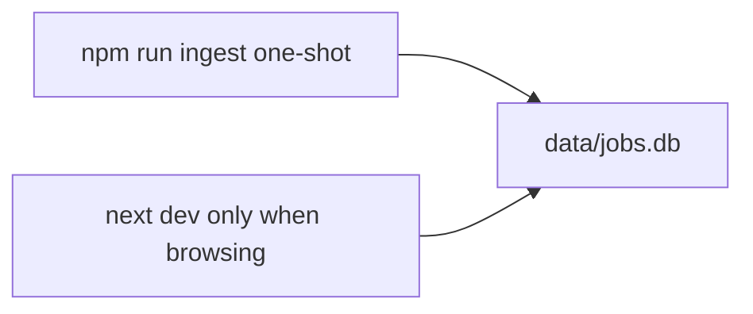
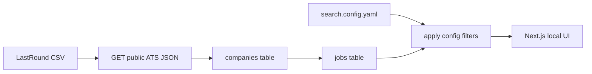

# Fill Gaps: Multi-ATS Aggregator Plan

The original blueprint is directionally right (discover slugs → poll public JSON → normalize → filter locally). The biggest hole is **slug discovery**: there is no official Greenhouse / Lever / Ashby company directory, so the plan over-indexed on paid SERP APIs. For a **personal job search**, skip paid SERP entirely.

Stay in one language: **TypeScript / Next.js**, not Python + Celery.

## Recommended tech stack

You already use React, TypeScript, Next.js, Tailwind, Node, and SQL. Use that stack end-to-end so ingest and UI share types.

| Layer | Choice | Why |
| --- | --- | --- |
| App / UI | Next.js (App Router) + TypeScript + Tailwind | Familiar; local `next dev` UI for ranked jobs |
| Ingest | Node scripts under `scripts/` (`ingest`, `verify-slugs`) | Same language as the app; run via `npm run ingest` |
| DB | SQLite via [better-sqlite3](https://github.com/WiseLibs/better-sqlite3) + [Drizzle](https://orm.drizzle.team/) | Zero-install server; file lives in `data/jobs.db` |
| Config | `search.config.yaml` validated with Zod | Edit filters without touching code |
| HTML strip | [cheerio](https://cheerio.js.org/) | Greenhouse `content` is HTML-entity soup |
| HTTP | native `fetch` + small retry helper | No extra client |
| Schedule | Manual `npm run ingest` (optional Task Scheduler later) | No always-on cron daemon; no cloud host |

**Do not install for v1:** PostgreSQL, Redis, Celery, Pinecone, Docker, Python, Serper/SerpApi.

### What you need installed on Windows

Already likely present (from your resume): Git, Node-related tooling, Cursor.

**Required**

1. [Node.js 22 LTS](https://nodejs.org/) — includes npm. Confirm with `node -v` / `npm -v`.
2. Git — already in use.

**Created by the project (no separate install)**

- Next.js, React, TypeScript, Tailwind, Drizzle, better-sqlite3, Zod, yaml, cheerio — all via `npm install` in [jb](C:\Users\junh4\Desktop\jb).
- SQLite is an embedded file; you do not install a database server.

**Optional later**

- [DB Browser for SQLite](https://sqlitebrowser.org/) if you want to inspect `data/jobs.db` by hand.
- Windows Task Scheduler to run `npm run ingest` nightly.

No Docker, no Postgres, no Python.

## Hosting and how you run it

**Local only.** Nothing is deployed to Vercel, AWS, or a VPS. The Next.js app and SQLite file (`data/jobs.db`) live in [jb](C:\Users\junh4\Desktop\jb) on this PC. You open `http://localhost:3000` when you want to browse.

Two separate processes — they do not depend on each other:



**You do not keep the app running overnight.** Next.js is just a viewer. Close the terminal when you are done looking at jobs. The database file stays on disk.

**You do not need cron for v1.** Ingest is a one-shot script: it starts, crawls (can take a few hours the first time), writes SQLite, then exits. Typical loop:

1. Once (or when you want fresh postings): `npm run ingest`
2. When you want to search: `npm run dev` → browse → quit

Windows has no Unix `cron`. If you later want it unattended, use **Task Scheduler** to run `npm run ingest` nightly while the PC is on. That is optional. If the PC is asleep, the job will not run — that is fine for a personal search.

**Laptop closed / PC off:** no jobs are collected. There is no cloud worker. Run ingest when the machine is awake.

**Do not** run ingest on every page load, and do not leave a 24/7 Node process just to poll ATS APIs.

## Where job listings show up

Ingest does **not** write a second jobs CSV. Listings land in two places on this PC:

1. **Database (source of truth):** [`data/jobs.db`](C:\Users\junh4\Desktop\jb\data\jobs.db) — created on first `npm run ingest`. Every normalized posting (title, company, location, pay, clean text, apply URL, rank) is a row in the `jobs` table. Inspect with [DB Browser for SQLite](https://sqlitebrowser.org/) if you want raw rows.
2. **App (what you read):** `http://localhost:3000` after `npm run dev` — a table of **ranked matches** only (filtered by `search.config.yaml`). Columns: title, company, location, pay, score, apply link. Click through to the ATS page.

The company-slug seed is already on disk and is **not** the job listings:

- [`datasets/lastroundai-ats-company-directory-2026-08.csv`](C:\Users\junh4\Desktop\jb\datasets\lastroundai-ats-company-directory-2026-08.csv) — ~9,935 company slugs. Ingest reads this into `companies`, then fetches each board’s JSON into `jobs`.

Until the first ingest finishes, the UI is empty. Console output during ingest is progress logs only (slug X of N, errors), not the job list.

## Scaffold commands (run from `C:\Users\junh4\Desktop\jb`)

Folder already has `datasets/`. Scaffold **in place** (do not create a nested app folder). PowerShell:

```powershell
cd C:\Users\junh4\Desktop\jb

# Next.js App Router + TS + Tailwind + ESLint + src/ + Turbopack
npx create-next-app@latest . --typescript --tailwind --eslint --app --src-dir --import-alias "@/*" --use-npm --turbopack --yes

npm install drizzle-orm better-sqlite3 zod yaml cheerio
npm install -D drizzle-kit @types/better-sqlite3
```

If `create-next-app` refuses a non-empty directory, pass the existing-folder prompt (or re-run with the same flags; `--yes` should accept it). Keep `datasets/` as-is.

After scaffold (implementation, not these commands): add `search.config.yaml`, Drizzle schema, `scripts/ingest.ts`, and `data/` (gitignored except `.gitkeep`).

## Search config file

Single source of truth: [`search.config.yaml`](search.config.yaml) at the repo root. Ingest ranks/stores match metadata; the Next.js UI reads the same file so tweaking YAML and refreshing the page changes results without recrawling (except pay/location inferred fields that were stored at ingest).

**Rule:** title / skill / location keyword filters can re-run on already-cached `jobs`. Only a full ingest refresh is needed when you want newer postings.

Zod schema (sketch) validates on app and script startup. Invalid YAML fails fast.

```yaml
# search.config.yaml — prefilled from Jun Huang resume + your choices
profile:
  name: Jun Huang
  home: Flushing, NY
  years_experience: 4  # Front-End Nov 2021 → present
  resume_path: ../Jun_Huang_Resume.pdf  # later: script to refresh this file

titles:
  include:
    - Full Stack
    - Frontend
    - Front-End
    - Front End
    - Software Engineer
    - Software Developer
    - React
    - Next.js
    - TypeScript
  exclude:
    - Staff
    - Principal
    - Distinguished
    - Manager
    - Director
    - VP
    - Intern
    - Contract
    - Mobile
    - iOS
    - Android
    - Embedded

locations:
  remote_ok: true
  hybrid_ok: true
  onsite_ok: true
  include:
    - Remote
    - New York
    - NYC
    - NY
    - Manhattan
    - Brooklyn
    - Queens
    - Flushing
    - Jersey City
    - Hoboken
    - Newark
  exclude:
    - Europe
    - UK
    - London
    - India
    - APAC

pay:
  min_usd: 110000
  currency: USD
  period: year
  require_listed_salary: false  # Greenhouse often has no salary; soft-filter when parsed

skills:
  required: []  # empty = no hard AND
  preferred:
    - React
    - TypeScript
    - Next.js
    - JavaScript
    - Node.js
    - Tailwind
    - SQL
    - HTML
    - CSS
  bonus:
    - AWS
    - Docker
    - C#
    - PHP
    - Electron
    - Figma
    - WordPress
  aliases:
    react: [react, react.js, reactjs]
    nextjs: [next.js, nextjs, next]
    typescript: [typescript, ts]
    nodejs: [node, node.js, nodejs]
    csharp: [c#, csharp, ".net", asp.net]
  min_preferred_hits: 2

seniority:
  include: [mid, senior]
  exclude: [intern, junior, staff, principal]

ingest:
  providers: [greenhouse, lever, ashby]
  polite_delay_ms: 300
  concurrency: 6
```

**Pay behavior:** if a job has a parsed salary and `max < 110000` (or listed max below min), drop it. If salary is missing and `require_listed_salary: false`, keep it and tag `salary_unknown`.

**Resume prefill (implementation later, after config exists)**

One-time script `npm run prefill-config` reads [Jun_Huang_Resume.pdf](C:\Users\junh4\Desktop\Jun_Huang_Resume.pdf) (or a copy under `data/`) and merges into YAML without overwriting your hand-tuned `pay` / `locations` / `exclude` lists. v1 ships the YAML above already filled; the PDF parser is a follow-on so you can drop an updated resume in later.

Mapped from the current resume:

- Titles from role names: Full Stack Developer, Front-End Developer, Software Engineer
- Skills from the Technical Skills block (React through SQL as preferred; AWS/Docker/C#/PHP/Electron/Figma/WordPress as bonus)
- Home + location tokens from Flushing, NY
- ~4 years experience from Nov 2021–present
- Pay and work-mode are **not** on the resume; you chose **$110k+** and **Remote + NYC/NY metro (hybrid or onsite OK)**



## Free slug sources (use these first)

Do **not** start with Serper / SerpApi. Seed from existing public lists, then verify each slug against the ATS JSON API (a 404 or empty/invalid payload = drop it).

**Tier 1 — download and import (hours, $0)**

- **LastRound ATS Company Directory (recommended first seed):** ~9,935 boards crawled July–August 2026. Columns: `ats_vendor`, `company_name`, `board_slug`, `last_crawled`. License **CC BY 4.0**.
  - GitHub: [fyrosofttech/lastroundai-hiring-data](https://github.com/fyrosofttech/lastroundai-hiring-data)
  - DataHub: [ats-directory](https://datahub.io/lastroundai-hiring-data/lastroundai-hiring-data/ats-directory)
  - Split: Greenhouse 4,966 / Ashby 2,856 / Lever 2,113
- **job-board-aggregator company JSON (optional, larger):** [Feashliaa/job-board-aggregator](https://github.com/Feashliaa/job-board-aggregator) ships per-ATS company lists under `data/*_companies.json` (~20k+ companies). License **CC BY-NC 4.0** — fine for personal use, **not** for a later commercial product. Their lists are harvested from Common Crawl.

Treat both as **stale snapshots**. Boards die (LastRound’s own spot-check: 1 of 9 Ashby slugs already 404). Import → verify → keep only live boards.

**Tier 2 — ongoing free discovery (no search API)**

- **Common Crawl CDX** (same method job-board-aggregator uses): query public CDX indexes for `boards.greenhouse.io/*`, `job-boards.greenhouse.io/*`, `jobs.lever.co/*`, `jobs.ashbyhq.com/*`, regex-extract the first path segment as slug, dedupe, then verify via the JSON APIs. Completely free; new CC crawls drop every ~1–2 months.
- **Domain-guessing** only as a supplement: take a name list you already care about (Y Combinator companies, your target employers) and try `{name}`, `{name}` with hyphens/no-spaces against all three APIs. Do not brute-force the entire English dictionary.

**Tier 3 — skip unless you later want freshness beyond CC**

- SERP dorks (`site:jobs.ashbyhq.com`) work but cost money and fight CAPTCHAs. The original cost table is optional, not the bootstrap path.
- DuckDuckGo HTML scraping is $0 but ToS-fragile; Common Crawl is the cleaner free equivalent.

## Corrections to the original API section

The Ashby URL in the blueprint is **wrong**. Official public posting API:

- **Ashby:** `GET https://api.ashbyhq.com/posting-api/job-board/{slug}?includeCompensation=true`
- Not: `https://api.ashbyhq.com/v1/publishing/jobBoard/{slug}`

Keep:

- **Greenhouse:** `GET https://boards-api.greenhouse.io/v1/boards/{slug}/jobs?content=true` (one call, no pagination; `content` is HTML-entity-encoded)
- **Lever:** `GET https://api.lever.co/v0/postings/{slug}?mode=json` (bare JSON array)

Validation must be stricter than “HTTP 200”:

- Greenhouse: live = 200 + JSON `jobs` array (empty list can still be a real empty board); dead = 404
- Lever: live = 200 + JSON array; dead = 404
- Ashby: live = 200 + object with `jobs`; dead = 404 or empty/non-JSON

Greenhouse can look “alive” with 0 jobs; keep the company but skip storing empty crawls. Also fetch Greenhouse `/v1/boards/{slug}` once to get the real `name` (Lever/Ashby often omit a company name field).

## Normalized job record

Keep the original core, plus fields the config will filter on:

- `external_id` — ATS-native id
- `posted_at` / `updated_at`
- `is_remote`, `workplace_type`
- `salary_min` / `salary_max` / `salary_unknown`
- `skills_matched`, `title_matched`, `rank_score`
- Unique key: `(ats_provider, board_slug, external_id)`

**Field mapping (minimum)**

- Greenhouse: `title`, `location.name`, `departments[].name`, `content` (unescape then strip HTML with cheerio), `absolute_url`, board `name`
- Lever: `text`, `categories.location` / `categories.team`, `description` or `descriptionPlain`, `hostedUrl` / `applyUrl`, `createdAt`
- Ashby: `title`, `location` / `locationName`, `department`, `descriptionPlain` or HTML `description`, `jobUrl`, `publishedAt`, `isListed` (drop `isListed=false`)

**Ingest rules**

- Never fetch on a page load. Run `npm run ingest` when you want newer postings (daily is enough; not required).
- Concurrency from config (`ingest.concurrency`, default 6). Extra-slow on Ashby. Honor `Retry-After` / 429.
- Two-phase Greenhouse optional: list without `content=true` to detect new/changed `updated_at`, then only pull full content for deltas.
- Dedup: same company can appear on two ATS after a migration; keep both rows.

**Ranking (no embeddings in v1)**

1. Title include hit (and not excluded)
2. Location / remote match
3. Pay: drop if listed below min; keep + tag if unknown
4. Preferred skill hits vs `min_preferred_hits`
5. Bonus skills bump score only

## Suggested build order (after you approve implementation)

[jb](C:\Users\junh4\Desktop\jb) already contains the LastRound CSV. Do not download it again.

1. Run the scaffold commands above (Next.js + Drizzle deps).
2. Add `search.config.yaml` + Zod loader (resume-prefilled).
3. Load [`datasets/lastroundai-ats-company-directory-2026-08.csv`](C:\Users\junh4\Desktop\jb\datasets\lastroundai-ats-company-directory-2026-08.csv) → `companies`.
4. Verify script: ping each slug, mark live/dead.
5. Per-ATS fetchers + cheerio strip → `data/jobs.db` `jobs` table.
6. Next.js table at `/` of ranked matches.
7. Later: `prefill-config` from an updated PDF; optional Common Crawl harvester.

## What this plan drops from the original

- SERP APIs as a required bootstrap.
- Postgres + Celery + vector DB as day-one infrastructure.
- Python ingest (replaced by Node so it matches your Next.js comfort).
- Domain-guessing the whole web.
